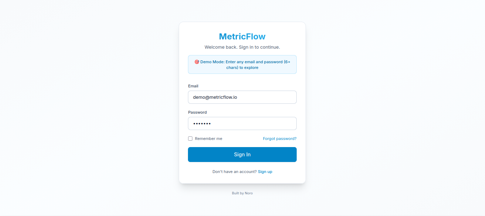
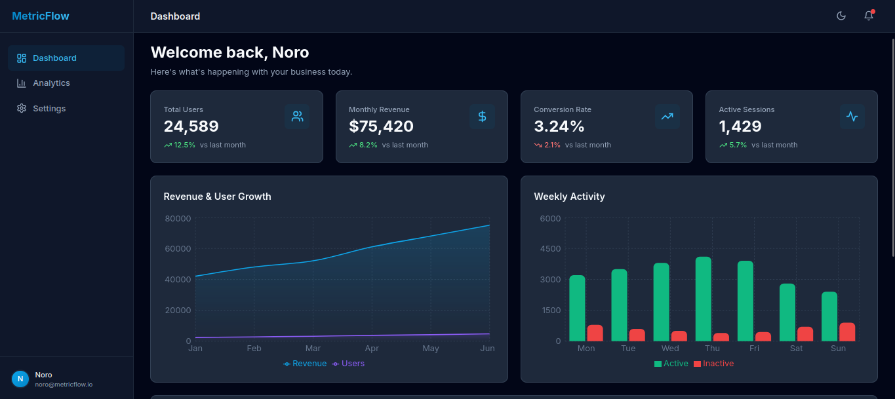
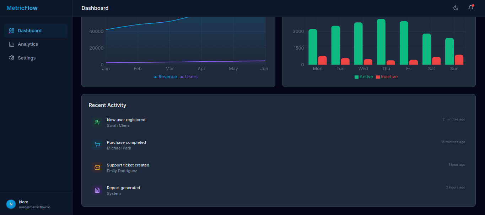
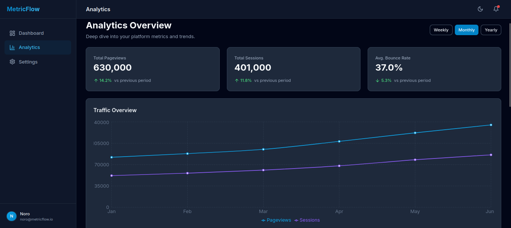
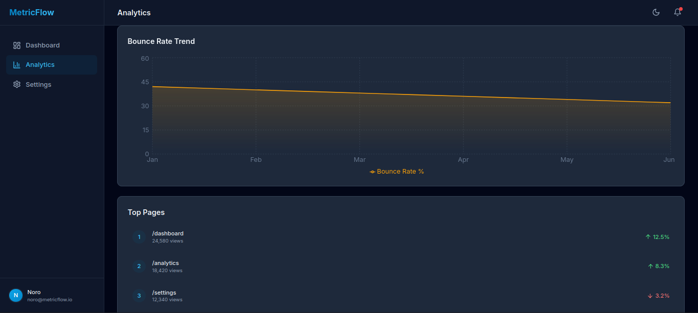
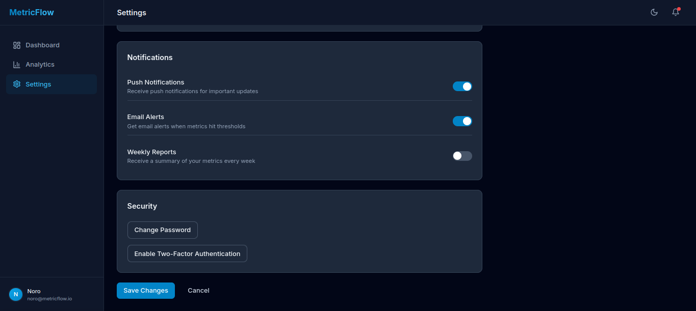

# MetricFlow

A modern, production-quality SaaS dashboard for startup founders to track metrics, monitor growth, and make data-driven decisions.

**[🚀 Live Demo](https://founder-dashboard-lime.vercel.app/)**


## Screenshots

### Login


### Dashboard



### Analytics



### Settings



## Features

### 📊 Comprehensive Dashboard
- Real-time metrics tracking (Users, Revenue, Conversion Rate, Active Sessions)
- Interactive charts with smooth animations
- Activity feed with recent user actions
- Trend indicators for all key metrics

### 📈 Advanced Analytics
- Multi-timeframe analysis (Weekly, Monthly, Yearly)
- Traffic overview with pageviews and sessions
- Bounce rate tracking and trends
- Top pages ranking with performance comparison

### ⚙️ Settings & Customization
- User profile management
- Notification preferences (Push, Email, Weekly Reports)
- Dark mode support with smooth transitions
- Security settings

### 🎨 Design Excellence
- Modern, clean UI with thoughtful spacing
- Professional color palette optimized for readability
- Responsive design for desktop and mobile
- Smooth animations and micro-interactions
- Dark mode with carefully crafted theme

## Tech Stack

- **Framework:** Next.js 15 with App Router
- **Language:** TypeScript
- **Styling:** Tailwind CSS
- **Animations:** Framer Motion
- **Charts:** Recharts
- **Icons:** Lucide React

## Project Structure

```
├── app/
│   ├── dashboard/          # Main dashboard page
│   ├── analytics/          # Analytics page with filters
│   ├── settings/           # Settings and preferences
│   ├── page.tsx            # Login page
│   ├── layout.tsx          # Root layout
│   └── globals.css         # Global styles
├── components/
│   ├── ui/                 # Reusable UI components
│   │   ├── Button.tsx
│   │   ├── Card.tsx
│   │   ├── Input.tsx
│   │   ├── Avatar.tsx
│   │   └── MetricCard.tsx
│   ├── layout/             # Layout components
│   │   └── Sidebar.tsx
│   └── charts/             # Chart components
│       └── Chart.tsx
├── tailwind.config.ts      # Tailwind configuration
├── tsconfig.json           # TypeScript configuration
└── package.json            # Dependencies
```

## Created by Noro

Built with attention to detail and modern best practices.

## License

MIT License - feel free to use this project for learning purposes.

---

Built with ❤️ by Noro
